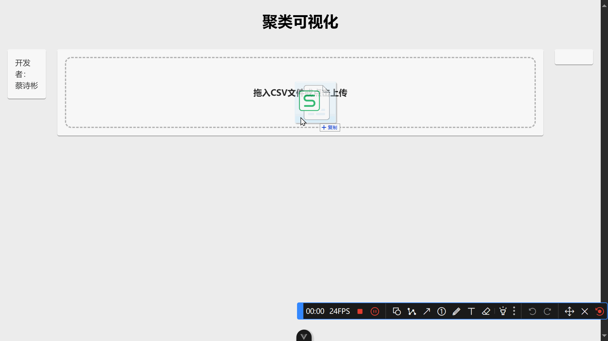

本项目是一个使用python+vue进行前后端开发的入门项目。项目实现的主要功能是：将需要处理的数据拖入前端网页，而后数据发到后端进行向量化和聚类分析，分析完毕后发回前端并显示。

前端采用 vue框架 + echarts 进行数据可视化，  
后端采用Flask框架与前端交互，使用numpy、pandas、kmeans_pytorch等库进行数据处理。



## 运行
分别打开 `python-server`目录 和 `vue-project`目录

- 在`python-server`目录下

```
pip install -r requirements.txt
python main.py
```
启动后端服务器

- 在`vue-project`目录下

```
npm install
npm run dev
```
打开前端网页，访问 `http://localhost:5173/`

